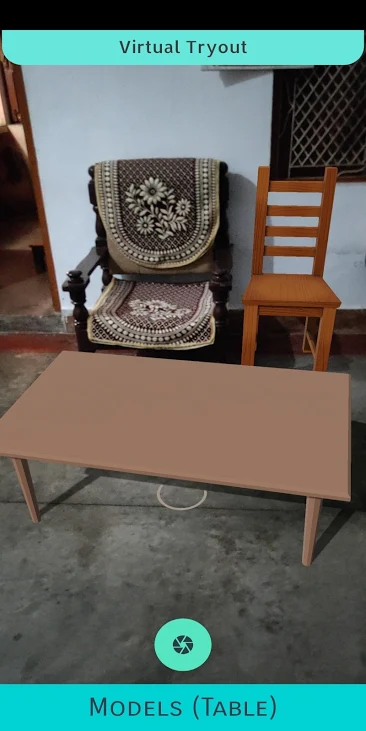

# Virtual Tryout
### An Augmented Reality android app which uses Google’s ARCore SDK for VR experience in android. It lets user place certain objects in the AR scene which looks like object placed in the real world as seen in phone’s screen. This can be used to see how object looks at a place before buying/relocating anything. The app also lets user to click images of the scene.

<a href="http://writeright.eastus.cloudapp.azure.com/"> Click here to see on play store </a>

## Some screenshots for illustration :

